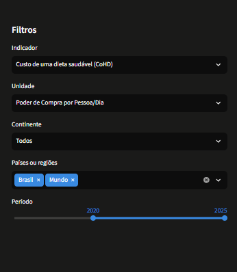
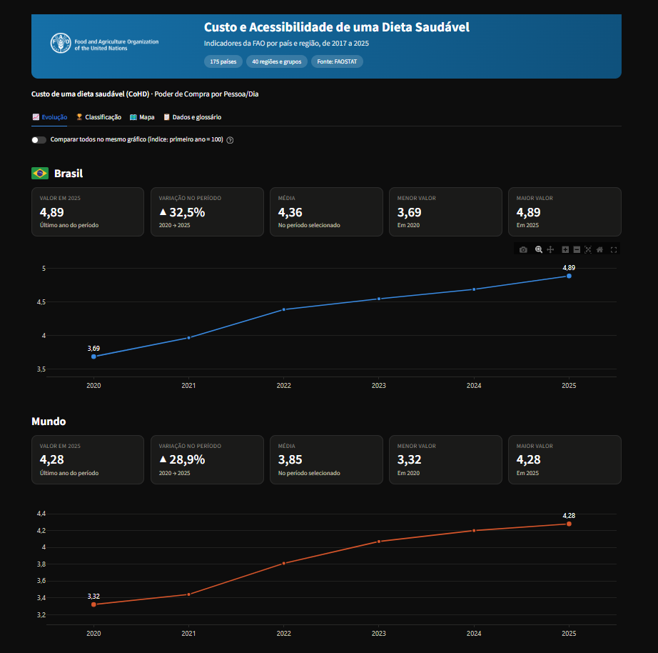
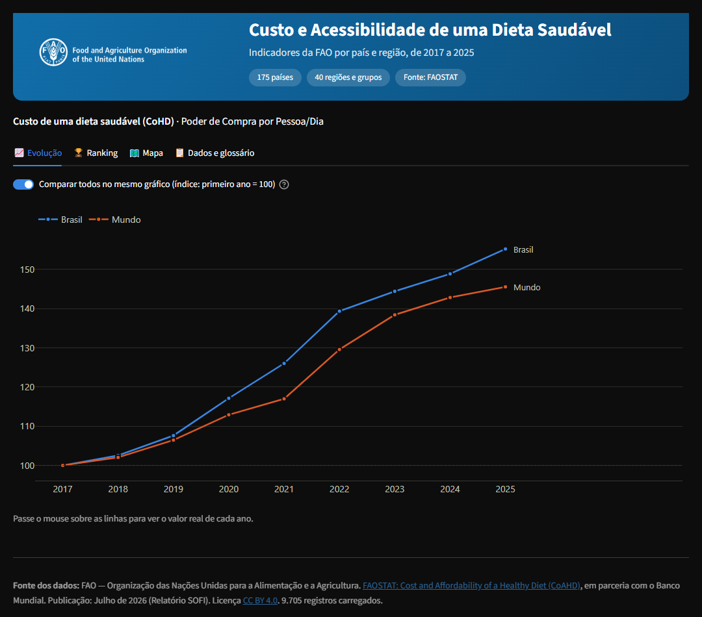
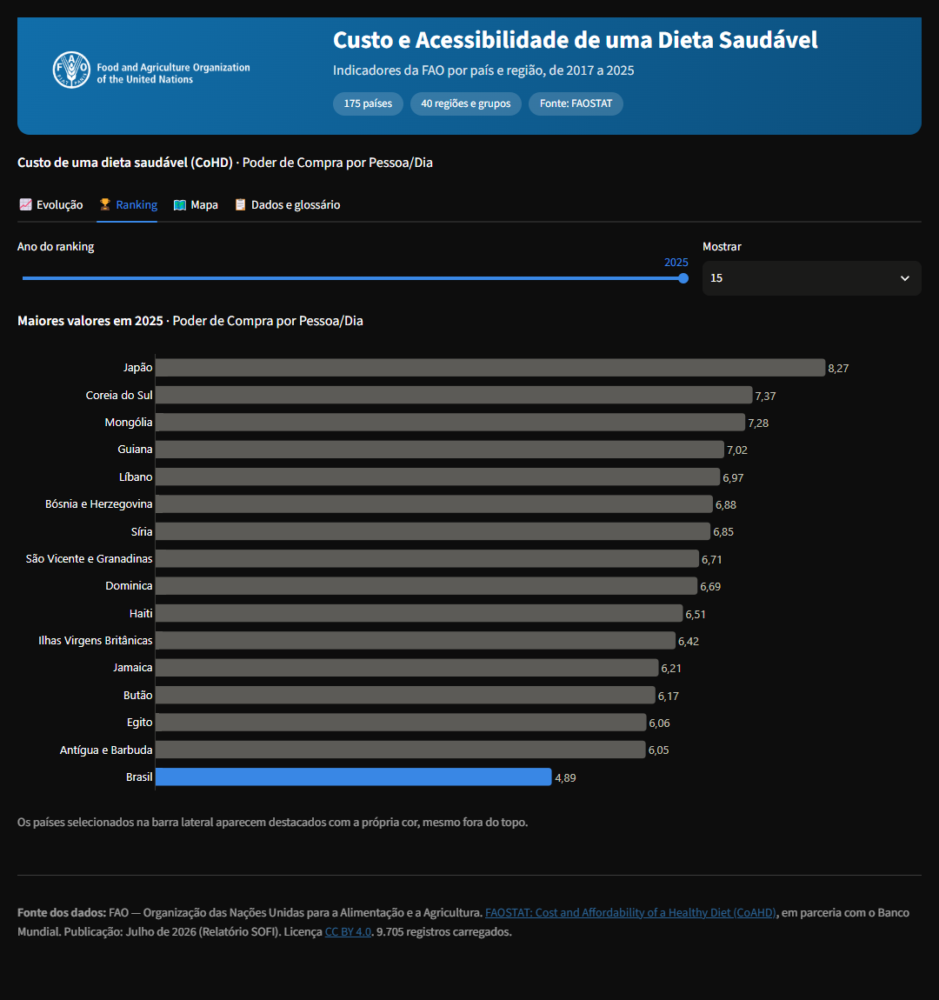
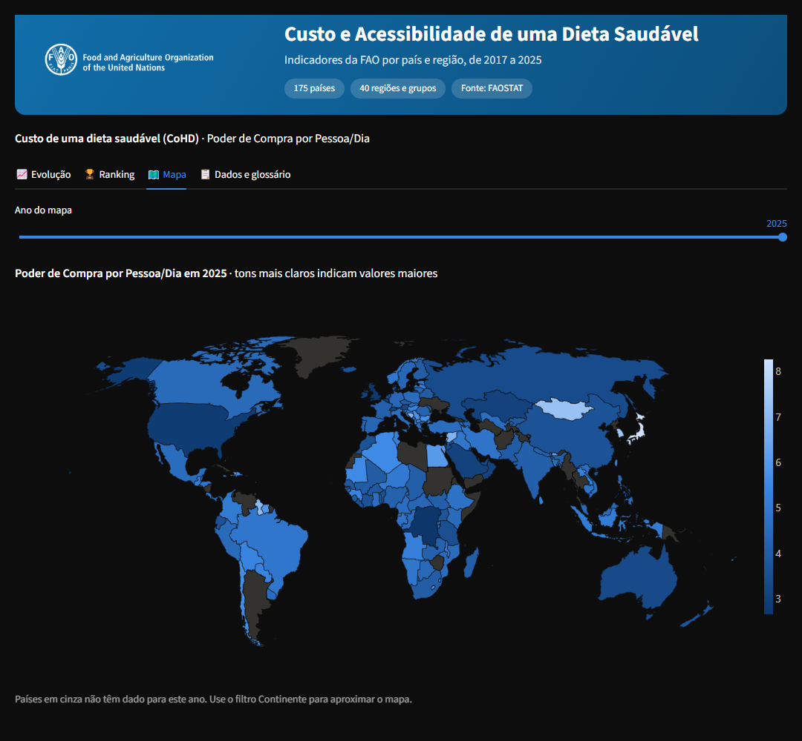

# Custo e Acessibilidade de uma Dieta Saudável

Painel interativo em **Streamlit** que mostra quanto custa uma dieta saudável e quantas pessoas não conseguem pagar por ela, por país e região, de 2017 a 2025. Os dados são da **FAO** (FAOSTAT).

## Sumário

1. [Objetivo](#1-objetivo)
2. [Fonte dos dados](#2-fonte-dos-dados)
3. [Tratamento da base](#3-tratamento-da-base)
4. [O painel](#4-o-painel)
5. [Decisões de análise e de design](#5-decisões-de-análise-e-de-design)
6. [Estrutura do projeto](#6-estrutura-do-projeto)
7. [Como executar](#7-como-executar)
8. [Verificação](#8-verificação)
9. [Limitações e próximos passos](#9-limitações-e-próximos-passos)
10. [Créditos e licenças](#10-créditos-e-licenças)

## 1. Objetivo

Permitir que qualquer pessoa explore, sem conhecimento técnico, três perguntas:

- Quanto custa uma dieta saudável em cada país e como isso mudou desde 2017?
- Quais países têm os valores mais altos?
- Como o problema se distribui pelo mundo?

## 2. Fonte dos dados

| Item | Detalhe |
|---|---|
| Origem | FAOSTAT, domínio **Cost and Affordability of a Healthy Diet (CoAHD)**, código `CAHD` |
| Instituições | FAO, em parceria com o Banco Mundial |
| Publicação | Julho de 2026 (Relatório SOFI, *The State of Food Security and Nutrition in the World*) |
| Dados | <https://www.fao.org/faostat/en/#data/CAHD> |
| Metadados | <https://www.fao.org/faostat/en/#data/CAHD/metadata> |
| Nota metodológica | <https://files-faostat.fao.org/production/CAHD/Methods_Brief_FAOSTAT_CoAHD_indicators.pdf> |
| Licença | Creative Commons Atribuição 4.0 (CC BY 4.0) |

Indicadores da base:

- **CoHD**: custo de uma dieta saudável.
- **Grupos de alimentos**: custo de amidos, alimentos de origem animal, frutas, leguminosas/nozes/sementes, vegetais e óleos/gorduras.
- **PUA**: percentual da população que não consegue pagar por uma dieta saudável.
- **NUA**: número de pessoas, em milhões, sem acesso a uma dieta saudável.

## 3. Tratamento da base

O arquivo original (10.320 linhas, em inglês) foi tratado e salvo como `Custo_Dieta_Saudavel_Traduzido_Completo.csv` (**9.705 linhas**, 9 colunas). As etapas foram:

| # | Etapa | Motivo |
|---|---|---|
| 1 | Removidas as colunas `Elemento` (sempre "Valor") e `Status_Dado` | Sem informação útil para o painel |
| 2 | Unidades renomeadas: `Int$ (Paridade do Poder de Compra) por pessoa por dia` → **Poder de Compra por Pessoa/Dia**; `%` → **Sem Dados**; `milhões de pessoas` → **Milhões de Pessoas**; `capita` → **per capita** | Nomes mais curtos e consistentes |
| 3 | Removido o sufixo ", média simples" / ", média ponderada" dos indicadores e mantida **só a média ponderada** (615 linhas de média simples descartadas) | Cada indicador aparece uma única vez no filtro |
| 4 | Criada a coluna `Continente` (África, Ásia, Europa, América do Norte, América Central e Caribe, América do Sul, Oceania e Grupos globais) | Filtro por continente e zoom do mapa |
| 5 | Corrigida a acentuação corrompida (`Curaçao`, `Côte d'Ivoire`, `Türkiye`) e **traduzidos para português os 215 nomes** de países e regiões | Painel totalmente em português |
| 6 | Criadas as colunas `Codigo_ISO` (2 letras) e `Codigo_ISO3` (3 letras) | Bandeiras e mapa-múndi |

Colunas finais: `Pais_Regiao`, `Codigo_ISO`, `Codigo_ISO3`, `Continente`, `Item_Analise`, `Ano`, `Publicacao`, `Unidade`, `Valor`.

A base tem **215 nomes**: 175 países e 40 regiões ou grupos (Mundo, África, faixas de renda, União Europeia e outros). Há 833 linhas sem valor na origem; elas foram mantidas no arquivo e ignoradas nos gráficos.

## 4. O painel

### Banner

Logo da FAO, título e resumo da base.

### Filtros (barra lateral)

- **Indicador**, **Unidade** e **Continente**: cada filtro mostra apenas o que existe para a escolha anterior.
- **Países ou regiões**: até 8 opções. O padrão é Brasil e Mundo.
- **Período**: intervalo de anos.



*Barra lateral com os filtros. Neste exemplo o indicador é o custo de uma dieta saudável, na unidade Poder de Compra por Pessoa/Dia, com Brasil e Mundo selecionados e o período de 2020 a 2025.* Os filtros são encadeados: ao trocar o indicador, a lista de unidades muda; ao escolher um continente, a lista de países mostra só os desse continente. Cada país selecionado ganha uma cor própria, que se mantém nos gráficos e no ranking.

### Abas

| Aba | O que mostra |
|---|---|
| 📈 Evolução | Um bloco por país, com bandeira, cinco cartões (valor atual, variação, média, menor e maior valor) e gráfico de linha. Um botão compara todos no mesmo gráfico, com índice (primeiro ano = 100). |
| 🏆 Ranking | Barras com os maiores valores entre os países em um ano. Os países selecionados ficam destacados. |
| 🗺️ Mapa | Mapa-múndi por ano, com zoom ao escolher um continente. |
| 📋 Dados e glossário | Tabela filtrada, botão para baixar o CSV e definição de cada indicador. |

### Como ler cada aba

#### Evolução: um bloco por país



*Cada país tem bandeira, cinco cartões e um gráfico de linha.* Neste exemplo, o custo de uma dieta saudável no Brasil passou de 3,69 em 2020 para 4,89 em 2025 (▲ 32,5%), em dólares internacionais por pessoa por dia. No Mundo, o custo foi de 3,32 para 4,28 (▲ 28,9%). Os números escritos no gráfico marcam o primeiro e o último ano; passe o mouse sobre a linha para ver o valor de qualquer ano. O eixo vertical de cada gráfico tem escala própria, para que a forma da curva fique legível mesmo entre países de valores muito diferentes.

#### Evolução: comparação por índice



*Com o botão "Comparar todos no mesmo gráfico" ligado, todos os países aparecem juntos.* Cada linha começa em 100 no primeiro ano, então a altura mostra quanto o custo cresceu em relação ao início, e não o valor em si. Aqui, o Brasil termina perto de 155 (custo 55% maior que em 2017) e o Mundo perto de 145 (45% maior), ou seja, o custo subiu mais rápido no Brasil. Essa é a forma mais justa de comparar países com escalas diferentes.

#### Ranking



*Os países com os maiores valores em um ano, com controle de ano e de quantidade.* Em 2025, o Japão tem o custo mais alto (8,27) e a Coreia do Sul vem em seguida (7,37). O Brasil (4,89) não está entre os 15 primeiros, mas aparece no final da lista, em azul, porque foi selecionado nos filtros. As barras cinza são os demais países.

#### Mapa



*Mapa-múndi do valor de cada país em um ano.* Tons mais claros indicam valores maiores, e a barra de cores à direita dá a escala. Os países em cinza não têm dado para o ano escolhido. Ao escolher um continente no filtro, o mapa se aproxima dessa região. Ranking e mapa só estão disponíveis em unidades comparáveis entre países (Poder de Compra, percentual e milhões de pessoas), não em moeda local.

### Rodapé

Traz a fonte, a publicação e a licença.

## 5. Decisões de análise e de design

- **Média ponderada**: a base traz, para regiões e grupos, uma versão de média simples e outra ponderada. Foi mantida a ponderada, que dá mais peso aos países maiores e representa a "pessoa típica" da região, e não o "país típico". Isso responde melhor à pergunta do painel, que é sobre custo por pessoa. A nota metodológica da FAO confirma o uso da população como peso nos agregados de prevalência (PUA) e informa que um agregado só é publicado quando os países com dado cobrem ao menos 50% da população da região. Para os agregados de custo, a nota consultada não detalha o peso; a escolha segue o mesmo raciocínio.
- **Moeda local não é comparável**: cada país usa uma moeda, então ranking e mapa ficam desativados nessa unidade, com um aviso. A evolução e a comparação por índice continuam disponíveis. A unidade padrão é *Poder de Compra por Pessoa/Dia*, que permite comparar.
- **Eixo Y independente** em cada gráfico de país, porque as escalas são muito diferentes (por exemplo, 160 contra 7,5 em moeda local).
- **Índice base 100**: forma de comparar países de escalas diferentes no mesmo gráfico, sem usar dois eixos.
- **Cores por entidade**: cada país mantém a mesma cor enquanto estiver selecionado. A paleta é categórica, em ordem fixa, com 8 cores (por isso o limite de 8 seleções).
- **Percentuais**: a unidade se chama "Sem Dados" no CSV; nos textos e eixos aparece como "% da população".
- **Bandeiras como imagem**: emojis de bandeira não aparecem no Windows. As imagens ficam na pasta do projeto, então o painel funciona sem internet.
- **Tema escuro** definido em `.streamlit/config.toml`, com as cores do painel e gráficos sobre fundo transparente.

## 6. Estrutura do projeto

```text
Relatorio_streamlit/
├── app.py                                        # painel (código principal)
├── Custo_Dieta_Saudavel_Traduzido_Completo.csv   # base tratada
├── requeriments.txt                              # dependências
├── README.md
├── .streamlit/
│   └── config.toml                               # tema escuro
├── assets/
│   ├── logo_fao_branco.png                       # logo com fundo transparente
│   └── bandeiras/                                # 175 bandeiras (PNG)
└── docs/
    └── imagens/                                  # capturas de tela usadas neste README
```

O `app.py` é dividido em etapas numeradas e comentadas: configuração, constantes, funções auxiliares, funções de gráficos, carregamento, banner, filtros, preparação dos dados e uma seção para cada aba.

## 7. Como executar

Pré-requisito: Python 3.10 ou superior.

```powershell
# 1. Criar e ativar o ambiente virtual
python -m venv .venv
.\.venv\Scripts\Activate.ps1

# 2. Instalar as dependências
pip install -r requeriments.txt

# 3. Iniciar o painel
streamlit run app.py
```

Se o PowerShell bloquear a ativação do ambiente, rode antes: `Set-ExecutionPolicy -Scope Process -ExecutionPolicy RemoteSigned`.

Se a pasta do projeto for movida, recrie o `.venv`. Os executáveis do ambiente guardam o caminho antigo e deixam de funcionar.

## 8. Verificação

- Teste automatizado com `streamlit.testing`: 137 combinações de indicador, unidade e continente, além do modo de comparação, do aviso de moeda local e da tela sem países selecionados, todos sem erro.
- Conferência visual das abas Evolução, Comparação, Ranking e Mapa em navegador.

## 9. Limitações e próximos passos

- Os dados são estimativas da FAO e há valores ausentes; países sem dado ficam em cinza no mapa.
- O mapa e o ranking só usam países; regiões e grupos aparecem apenas na aba Evolução.
- Regiões podem incluir países de outros continentes na definição da FAO (por exemplo, o México está em "América do Norte" no filtro, mas a FAO o inclui em "América Central").
- Próximos passos possíveis: publicar no Streamlit Community Cloud (renomear `requeriments.txt` para `requirements.txt`), adicionar comparação entre dois indicadores e traduzir a interface para outros idiomas.

## 10. Créditos e licenças

- **Dados**: FAO / FAOSTAT, com o Banco Mundial, sob CC BY 4.0. Cite sempre a fonte.
- **Logo da FAO**: marca da Organização das Nações Unidas para a Alimentação e a Agricultura. Se o painel for divulgado publicamente, confira a política de uso de marca da FAO.
- **Bandeiras**: obtidas em [flagcdn.com](https://flagcdn.com).
- **Bibliotecas**: Streamlit, Pandas e Plotly.
